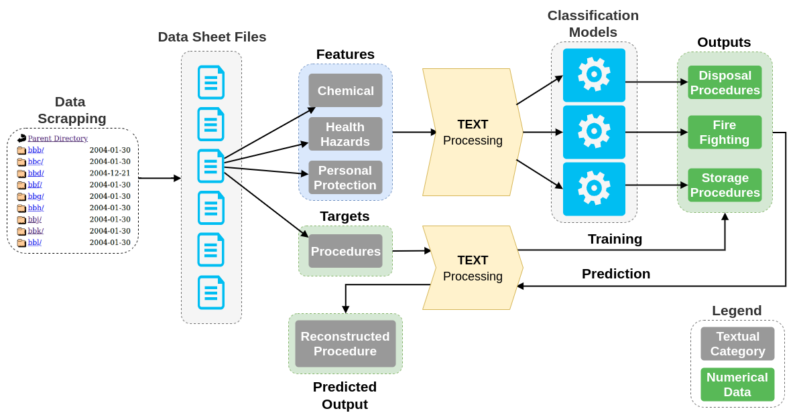

# Material Safety Data Sheet - Operator Procedures Predictor (MSDS-OPP)
The MSDS-OPP allows the prediction of the operator procedures for disposal, storage, and fire situations. 
To accomplish these goals, the MSDS-OPP performs most of the steps of an end-to-end NLP project. 
The tool architecture starts with the data acquisition from the web, then using text processing techniques 
extracts the features and class labels,
with them, train one classifier to each procedure, 
and finally reconstruct the classifier output to a procedure description.



In more detail the MSDS-OPP architecture has five different
stages: 1) the data scrapping, that gets the MSDS files from the
web; 2) the feature extraction, which extracts features from the
MSDS files and applies NLP methods to feed the classifiers
with clean data; 3) the label transformation, that converts the
label procedure text description in a set of class labels, which
are used as targets to train and validate the classification
model; 4) the classification models, which implements and
validates different classification models to predict the operator
procedures; and 5) the description reconstruction, that given
the predicted class labels transforms these tuples in a standard
description of the procedures.

## Usage

This project uses the Python3 environment.
To install the dependencies use the pip dependency manager

```bash
# install requirements
pip install -r requirements.txt
```

Before, start executing anything the help message would help you understanding all the options:

```bash
usage: main.py [-h] [-j n_jobs] [-s] [-e data_folder] [-t n_feature n_class]
               [-l procedures_list] [-c classifier model] [-p file_path]

optional arguments:
  -h, --help            show this help message and exit
  -j n_jobs             number of jobs to use (default: 8)
  -s                    scrapes the MSDS data from the web
  -e data_folder        extract the dataframes from the dataset, you must
                        specify the dataset name e.g. datasheets
  -t n_feature n_class  train with 70% of the dataset and score with 30% of
                        the dataset, specify the number of features and target
                        classes (default 150 features and 20 classes)
  -l procedures_list    procedures to use as labels (e.g. '["fire", "storage",
                        "disposal"]')
  -c classifier model   classifier model to use (decision_tree or k_neighbors)
  -p file_path          predict the procedures for a certain MSDS with a file
                        path

```

To extract the information from the MSDS and train a model use the following commands.
After that, you are able to predict the operator procedures for a certain MSDS file using the trained model.

```bash
# parses/extracts the pandas data frames from the MSDS files 
# in the mini_dataset folder
python core/main.py -e mini_dataset

# trains the model to predict the fire procedures 
# with 150 features and 20 class labels 
# using the KNN classification model
python core/main.py -t 150 20 -l '["fire"]' -c decision_tree

# predicts the fire procedures for the a MSDS file
python core/main.py -p mini_dataset/demo_files/bdfkf.txt
```

Additionally if you want to obtain the full dataset, from _hazards.com_:

```bash
# scrapes all the MSDS from 'hazards.com'
python core/main.py -s 
```

## Data Organization

The full dataset contains **253963** files, with a total size of **1.5GB**.
There are 2 different types of datasheet: 
the **f1** type that contains **17454** files (**155.4MB**) and 
the **f2** type that contains **236507** files (**1.3GB**).

The following table shows all the variables present in each file. 
The variables are grouped in categories: **chemical**, **health**, **personal** and **procedures**. 


| Features                 |  Category  |       Type       | Model  |
|:-------------------------|:----------:|:----------------:|:------:|
| file_name                |    info    |    identifier    |   -    |
| product_name             |    info    |      string      |   -    |
| company                  |    info    |      string      | Input  |
| boiling_point            |  chemical  |     numerical    | Input  |
| vapor_density            |  chemical  |     numerical    | Input  |
| vapor_pressure           |  chemical  |     numerical    | Input  |
| flash_point              |  chemical  |     numerical    | Input  |
| evaporation_rate         |  chemical  |      string      | Input  |
| appearance               |  chemical  | text description | Input  |
| ingredients              |  chemical  |       list       | Input  |
| decomposition_products   |  chemical  |       list       | Input  |
| conditions_avoid         |  chemical  |       list       | Input  |
| materials_avoid          |  chemical  |       list       | Input  |
| effects_overexposure     |   health   |health description| Input  |
| carcinogenicity_iarc     |   health   |       1/0        | Input  |
| carcinogenicity_ntp      |   health   |       1/0        | Input  |
| carcinogenicity_osha     |   health   |       1/0        | Input  |
| extra_carcinogenicity    |   health   | text description | Input  |
| health_hazards           |   health   |health description| Input  |
| first_aids               |   health   |health description| Input  |
| eyes_protection          |  personal  |      string      | Input  |
| protective_gloves        |  personal  |      string      | Input  |
| ventilation              |  personal  |      string      | Input  |
| respiratory_protection   |  personal  | text description | Input  |
| protective_equipment     |  personal  | text description | Input  |
| other_precautions        |  personal  | text description | Input  |
| extinguishing_media      | procedures |       list       | Target |
| fire_fighting_procedures | procedures | text description | Target |
| spill_procedures         | procedures | text description | Target |
| storage_precautions      | procedures | text description | Target |
| disposal                 | procedures | text description | Target |

**NOTE**: The dataset present in this repository is a small one +/- 3000 files. To use the bigger one you need to scrape 
it (check the usage).

## Results

The classification report for 150 features, 20 labels, the decision_tree as classification model, 
to prediction the fire fighting procedures.

```bash
Classification report: 
                                                                precision    recall  f1-score   support

                                                  expose fire       0.69      0.63      0.66        73
fire fighters niosh approved scba & full protective equipment       0.78      0.59      0.67        66
                            combustion products this material       1.00      1.00      1.00        48
                                          cool fire container       0.31      0.45      0.37        20
                chemical protective suit self contd brthg app       1.00      1.00      1.00        17
                                    fire protective equipment       0.33      0.41      0.37        17
                                        container water spray       0.28      0.38      0.32        13
                                           prefer large fires       0.70      0.47      0.56        15
                                             inhalation smoke       0.73      1.00      0.84         8
                                      operate pressure-demand       0.86      0.75      0.80         8
                                                   water cont       0.57      0.80      0.67         5
                                             extinguish agent       0.83      1.00      0.91         5
                        fire hazardous decomposition products       0.50      0.33      0.40         6
                                                guard contact       1.00      1.00      1.00         7
                                              contact product       1.00      1.00      1.00         7
                                                  contact eye       1.00      1.00      1.00         7
                                    contact salvage operation       1.00      1.00      1.00         7
                                     co2 scba w/full facpiece       1.00      1.00      1.00         8
                alcohol foam scba & full protective equipment       1.00      1.00      1.00         4
                                       straight streams water       0.57      1.00      0.73         4

                                                    micro avg       0.72      0.72      0.72       345
                                                    macro avg       0.76      0.79      0.76       345
                                                 weighted avg       0.75      0.72      0.72       345
                                                  samples avg       0.19      0.18      0.18       345

ROC:  0.8927749846456715 
```

... and their respective plot.


## Cite this Work

Cite this dataset/work with the following reference (bibtex entry):

```bash
@inproceedings{msds-opp,
    author = {Pereira, Eliseu},
    year = {2020},
    month = {02},
    pages = {},
    title = {MSDS-OPP: Operator Procedures Prediction in Material Safety Data Sheets},
    doi = {10.24840/978-972-752-264-4}
}
```

 
